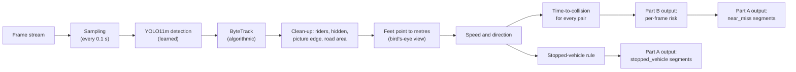

# Traffic Event Detection and Accident Anticipation from a Fixed Road Camera

**WIUT Hackathon 2026 — Elimination Round, Computer Vision Track**<br>
Team **Just Think** (reference `265EEEE8`) · Westminster International University in Tashkent

| Resource | Location |
|---|---|
| Team website (EDA, results, technical report) | https://traffic-website-gtcgucwwfaudekw7aza9od.streamlit.app |
| Source repository (submitted tag) | https://github.com/mohinur2009/traffic_hackathon @ `v1.0` |
| Model weights | `weights/yolo11m.pt`, fetched by `weights/download.sh` (38.7 MB) |
| Predictions on the sample videos | [`predictions_samples.json`](predictions_samples.json) |

---

## Abstract

This repository implements an offline video-analytics system for a single, fixed CCTV road camera. It addresses two tasks defined by the organisers:

- **Part A — Traffic event detection.** Given an `.mp4` file, the system returns traffic events as temporal segments `[start_sec, end_sec, label]`. The current version detects two of the 14 official classes: `near_miss` and `stopped_vehicle`.
- **Part B — Accident anticipation.** Given frames one at a time, the system returns, for each frame, the probability that an accident will begin within the next 5 seconds, using past frames only.

The solution combines an open-weight object detector and a multi-object tracker with explicit scene geometry: a road-area mask and a bird's-eye (ground-plane) transformation calibrated on a zebra crossing measured on satellite imagery. All speeds and distances are therefore in metres, and risk is derived from **time-to-collision (TTC)** between road users. It runs fully offline on a single GPU within the time budget and is executed with the two commands given in Section 1.

---

## Contents

1. [Installation and Usage](#1-installation-and-usage)
2. [Repository Structure](#2-repository-structure)
3. [Method](#3-method)
4. [Models, Datasets and Licences](#4-models-datasets-and-licences)
5. [Computational Budget](#5-computational-budget)
6. [Determinism](#6-determinism)
7. [Reproducibility](#7-reproducibility)
8. [Results](#8-results)
9. [Compliance with Competition Rules](#9-compliance-with-competition-rules)
10. [Limitations and Future Work](#10-limitations-and-future-work)
11. [Team and Contributions](#11-team-and-contributions)
12. [Acknowledgements and Licence](#12-acknowledgements-and-licence)

---

## 1. Installation and Usage

**Requirements.** Python 3.10 or later; an NVIDIA GPU with CUDA.

### 1.1 Installation

```bash
git clone https://github.com/mohinur2009/traffic_hackathon.git
cd traffic_hackathon
pip install -r requirements.txt
```

### 1.2 Model weights

The weights are obtained once, with internet access, before evaluation:

```bash
bash weights/download.sh
```

The script downloads `yolo11m.pt` (38.7 MB, official Ultralytics release) into `weights/` and does nothing if the file is already present. No network access is required after this step.

### 1.3 Inference

```bash
python run_submission.py --videos /data/test --out predictions.json
```

`run_submission.py` and `evaluate.py` are the organiser-provided starter-kit files and are included **unmodified**. The harness imports `solution.py` from the repository root, calls `detect_events()` for each video, and streams every frame through `RiskEstimator`.

### 1.4 Validation

```bash
python evaluate.py --pred predictions.json --validate-only
```

---

## 2. Repository Structure

```
.
├── solution.py               Official interface: CLASSES, detect_events(), RiskEstimator
├── run_submission.py         Starter kit (unmodified)
├── evaluate.py               Starter kit (unmodified)
├── requirements.txt          Python dependencies
├── weights/
│   └── download.sh           Downloads yolo11m.pt
├── src/
│   ├── risk.py               Part B: causal RiskEstimator (detection, tracking, metres, speed, TTC, score)
│   ├── events.py             Part A: rule-based events built on src/risk.py
│   └── track.py              Offline detector + tracker that caches tracks for analysis
├── tools/
│   ├── check_tracks.py       Visual checks of cached tracks (trajectories, counts, clips)
│   └── speed_test.py         Speed comparison of detector sizes and frame strides
├── examples/                 Starter-kit example ground truth and predictions
├── predictions_samples.json  System output on the four sample videos
└── README.md
```

---

## 3. Method

### 3.1 System overview



### 3.2 Learned and rule-based components

| Component | Nature | Description |
|---|---|---|
| Object detector | Learned (pretrained, open weights) | YOLO11m, COCO weights, **no fine-tuning**; detects persons, bicycles, cars, motorcycles, buses and trucks. |
| Tracker | Algorithmic, no training | ByteTrack (Ultralytics implementation) assigns persistent identities. |
| Scene geometry | Manually configured, once | Road-area polygon (12 points) and a perspective transform from the main zebra crossing (26.2 m × 4.5 m, measured on satellite imagery) to ground-plane metres. |
| Clean-up rules | Rule-based | Person on a bike becomes a rider; boxes cut by the picture edge and objects hidden behind a closer one are skipped. |
| Risk estimation (Part B) | Rule-based physics | TTC between road users, mapped to a score by a fixed function (no fitting). |
| Event detection (Part A) | Rule-based | Rules over the Part B pipeline (Section 3.5). |

**Design rationale.** The hidden test set is recorded by the same camera from the same angle, so an explicit scene model transfers directly, needs no labelled training footage, and makes every alarm traceable: which two road users, how far apart, how fast they approach, and how many seconds are left.

### 3.3 Perception and geometry

- **Detection.** YOLO11m at input size 1280 (the frames are 3840 × 2160; the default 640 loses small, distant road users), confidence threshold 0.3.
- **Tracking.** ByteTrack; a track's type is the majority vote over its last ~1 s.
- **Feet point.** The bottom-middle of each box, i.e. where the object touches the road.
- **Bird's-eye view.** The four corners of the main crossing in the image are mapped to its real size in metres. Check: the measured median walking speed of pedestrians is 4.9 km/h (typical walking speed ≈ 5 km/h). Risk is computed only within ~25 m of the crossing, where the metric positions are reliable.
- **Speed.** Mean position over the last 0.5 s compared with the 0.5 s before; median of the last five estimates. A jump faster than 25 m/s resets the track history (identity switched to another object).

### 3.4 Part B: causal accident anticipation

`RiskEstimator` (in `src/risk.py`) keeps its own detector and tracker state and is updated only through `step(frame, t_sec)`. It never opens the video file and never uses Part A output. YOLO runs about every 0.1 s; the latest score is returned for intermediate frames. All rules are in seconds and metres, so 25 fps and 30 fps videos behave the same, and the scene geometry is rescaled to the frame size.

A pair of road users is considered only when it resembles the start of a real crash:

- at least one vehicle moving faster than 2 m/s, or a rider faster than 3 m/s; two pedestrians are never paired;
- they approach at ≥ 1 m/s and start more than 0.5 m further apart than their "touching" distance;
- vehicles moving the same way in neighbouring lanes (> 1.8 m sideways) are ignored unless one moves sideways; passing a (nearly) stationary road user more than 1.3 m to the side is ignored;
- in the same lane only a fast approach (≥ 3 m/s) counts;
- the TTC must be found three times in a row (~0.3 s) without increasing.

The smallest confirmed TTC is mapped to a score `1 / (1 + exp(2 · (TTC − 1 s)))`, so TTC = 1 s gives 0.5 (the alarm threshold), 0.5 s gives 0.73 and 1.5 s gives 0.27. The score is averaged over the last 0.3 s.

### 3.5 Part A: event detection rules

Part A runs the same pipeline on one frame every 0.2 s. As allowed by the rules, it reuses Part B's risk signal.

| Label | Detection criterion | Segment start | Segment end |
|---|---|---|---|
| `near_miss` | Risk score ≥ 0.5 (a confirmed conflict with TTC ≲ 1 s); alarms < 1 s apart merged, blips < 0.4 s dropped | 0.5 s before the first alarm frame | 1 s after the last alarm frame |
| `stopped_vehicle` | Vehicle seen driving (> 2 m/s) stands still (< 0.5 m/s) for ≥ 10 s and is not queuing (fewer than 2 other stopped vehicles within 12 m for most of the stop) | Vehicle stops | Vehicle moves or is lost |

**Class coverage.** Only `near_miss` and `stopped_vehicle` are predicted. A predicted class that never occurs in the test set enters the macro average with an F1 of zero, so classes without a validated rule are not predicted. `jaywalking` and `wrong_way` were planned but need outlines of all crossings and islands, and lane directions, respectively.

### 3.6 Exploratory data analysis

The full analysis is on the team website. Findings that shaped the design:

1. **4K H.264 decoding dominates the runtime.** Reading the frames alone takes about 1.6 × the video length on a Kaggle T4 machine, more than the detector, so frames are sampled every 0.1–0.2 s.
2. **Perspective squashes distant lanes.** Distances in pixels produced 2328 close-call moments in 10 s of calm traffic (e.g. a truck passing a bus at its stop). Converting to metres and keeping only the calibrated area removed almost all of them.
3. **Dense, slow traffic.** Median speeds: pedestrians 4.9 km/h, cars 16.6 km/h, truck 19.5 km/h (first 10 s of C3905, evening). Road users are constantly within 2–3 m of each other, so closeness alone cannot mean danger; this led to the lane, passing and minimum-speed rules.
4. **Occlusion corrupts positions.** Vehicles partly hidden in queues produced impossible speeds (8–15 m/s in a queue); skipping hidden objects and using median speeds fixed this.

---

## 4. Models, Datasets and Licences

### 4.1 Models

Only open-weight models are used. No hosted or commercial model (e.g. OpenAI, Google Gemini, Anthropic) is invoked at any stage of inference. AI assistants were used solely to support the writing of code, the website and documentation, as permitted by the rules.

| Model | Purpose | Source | Licence |
|---|---|---|---|
| YOLO11m (COCO) | Object detection (Parts A and B) | [Ultralytics](https://github.com/ultralytics/ultralytics) | AGPL-3.0 |
| ByteTrack (Ultralytics implementation) | Multi-object tracking | [Ultralytics](https://github.com/ultralytics/ultralytics); original method by Zhang *et al.* | AGPL-3.0 (implementation) |

### 4.2 Datasets

| Dataset | Use | Licence |
|---|---|---|
| Organiser sample videos (`C3896`, `C3897`, `C3902`, `C3905`) | Exploratory analysis, scene configuration, rule tuning | Provided by the organisers for the competition |
| MS COCO 2017 | Pre-training of the detector checkpoint (not retrained by the team) | Annotations CC BY 4.0; images subject to Flickr terms |
| Satellite imagery (Yandex Maps) | One-time measurement of the crossing size (26.2 m × 4.5 m) | Used for measurement only; no imagery redistributed |

The sample videos are not redistributed in this repository. No footage from this camera was obtained from any source other than the organisers.

---

## 5. Computational Budget

**Constraint:** wall-clock time for Parts A and B combined must not exceed three times the video duration.

| Technique | Effect |
|---|---|
| Frame sampling | Part B runs YOLO every 0.1 s, Part A every 0.2 s; skipped frames use `grab()` (no image conversion) |
| Lightweight `step()` | Returns the latest score for frames without detection |
| Part A time guard | Part A stops after 0.7 × the video duration and keeps the events found so far, leaving the rest of the budget to Part B |

Measured with the official harness on Kaggle (Tesla T4, 4 vCPU), final run on all four sample videos; the evaluation machine has 8 CPU cores, so decoding should be faster there:

| Video | Length | Part A | Part B | Total | Budget (3 ×) |
|---|---|---|---|---|---|
| C3896 | 340 s | 241 s | 685 s | 925 s (2.72 ×) | 1021 s |
| C3897 | 318 s | 223 s | 642 s | 865 s (2.72 ×) | 954 s |
| C3902 | 318 s | 223 s | 649 s | 872 s (2.74 ×) | 954 s |
| C3905 | 128 s | 90 s | 246 s | 336 s (2.63 ×) | 383 s |

All four videos finished inside the budget with no errors. On this machine Part A reached its time guard (0.7 × duration) on every video, so it analysed roughly the first part of each video; on faster hardware it covers more.

---

## 6. Determinism

- Seed `0` is applied to Python `random`, NumPy and PyTorch in `RiskEstimator.reset`.
- Frames are processed in a fixed order with fixed sampling intervals.
- **Residual non-determinism.** GPU floating-point differences can cause tiny score differences across machines. Part A's time guard depends on machine speed: on a slower machine it may stop earlier within a long video.

---

## 7. Reproducibility

```bash
# Place the four organiser sample videos in ./samples/
bash weights/download.sh
python run_submission.py --videos samples --out predictions_samples.json --team just-think
python evaluate.py --pred predictions_samples.json --validate-only
```

The committed `predictions_samples.json` is the output of this procedure on Kaggle (all four videos within budget, format check `VALID` with 0 errors and 0 warnings). Because of Part A's time guard, the events can differ slightly between machines (Section 6).

---

## 8. Results

No ground-truth labels exist for the sample videos, so no Score A / Score B is reported. Instead:

**False-alarm reduction** (close-call moments in the first 10 s of C3905, calm traffic): 2328 (pixel distances) → 935 (metres) → 808 (skip pairs already side by side) → 725 (steadier speeds) → 62 (calibrated area only) → 32 (vehicle must really move). The one remaining pair is a real conflict: a car drives onto the crossing while a pedestrian walks toward it.

### 8.1 Part B: alarms on the full videos

Alarms = runs of score ≥ 0.5, merged if less than 2 s apart (as in the official metric), from the committed `predictions_samples.json`. None of the sample videos contains a known accident, so every alarm is a candidate false alarm and was checked by eye where possible.

| Video | Length | Light | Alarms | Rate |
|---|---|---|---|---|
| C3905 (used for tuning) | 2:08 | Evening | 3 | ≈ 1.4 per min |
| C3896 (not used for tuning) | 5:40 | Daytime | 1 | ≈ 0.2 per min |
| C3897 (not used for tuning) | 5:18 | — | 2 | ≈ 0.4 per min |
| C3902 (not used for tuning) | 5:18 | — | 3 | ≈ 0.6 per min |

The rules were tuned on C3905 only and then frozen, so the other three videos are an unbiased check: the alarm rate stays low on videos the rules never saw.

Alarms checked by eye during development (C3896): a delivery motorcycle entering a crossing with pedestrians on it (real conflict), a car passing an almost stopped car at the stop line (borderline), and a car pulling out while another passes at 36 km/h near the picture edge (uncertain). On C3905: a car passing very close to a waiting motorcyclist, and a car driving around the island next to a standing pedestrian (close passes, not crashes).

### 8.2 Part A: events

All six events in the committed predictions:

| Video | Event | Start (s) | End (s) |
|---|---|---|---|
| C3896 | `stopped_vehicle` | 59.5 | 106.5 |
| C3896 | `stopped_vehicle` | 127.7 | 140.7 |
| C3897 | `stopped_vehicle` | 41.2 | 51.7 |
| C3902 | `stopped_vehicle` | 88.7 | 106.7 |
| C3905 | `stopped_vehicle` | 2.6 | 13.4 |
| C3905 | `near_miss` | 17.5 | 19.6 |

Checked by eye on C3905: the `stopped_vehicle` is a car that drives onto the crossing and stands there about 11 s while pedestrians cross; the `near_miss` is a car passing very close to a motorcyclist waiting at the red light.

Risk curves, example alarms and failure cases are on the website.

---

## 9. Compliance with Competition Rules

| Requirement | Status |
|---|---|
| `solution.py` at the repository root exposes `CLASSES`, `detect_events` and `RiskEstimator` | Satisfied |
| `run_submission.py` and `evaluate.py` unmodified | Satisfied |
| Open-weight models only; no hosted APIs during inference | Satisfied |
| Offline execution after weight retrieval; weights ≤ 5 GB (38.7 MB) | Satisfied |
| `RiskEstimator.step` uses only previously received frames and no Part A output | Satisfied |
| Fixed seeds (Section 6) | Satisfied |
| Data limited to organiser samples and public datasets | Satisfied |
| Third-party code attributed (Section 12) | Satisfied |
| `evaluate.py --validate-only` passes on the submitted predictions | Satisfied (`VALID`, 0 errors, 0 warnings) |

---

## 10. Limitations and Future Work

**Limitations.**

- No accident examples in the samples: the alarm threshold comes from physics (TTC = 1 s) and was checked by eye, not learned.
- Only 2 of 14 event classes are detected.
- Tracker identity swaps when road users overlap (e.g. a pedestrian walking through a waiting rider).
- The far road (> 25 m from the crossing) is excluded from risk: one calibration near the camera is less accurate far away.
- Vehicles are modelled as circles, and turning vehicles are predicted as going straight.
- Boxes cut by the picture edge are ignored.

**Future work.**

- Label events on the sample videos to measure Score A and B and tune thresholds.
- `jaywalking` (with outlines of crossings and islands), `wrong_way` (with lane directions), and red-light events (with traffic-signal colour).
- More calibration points for the far road; oriented boxes for long vehicles.
- GPU (NVDEC) video decoding to free time for a larger detector or denser sampling.
- A lightweight temporal model trained on public crash datasets (e.g. DoTA, CCD) to complement the rules.

**Practical relevance.** Many cities, including Tashkent, operate extensive traffic-camera networks whose footage is typically reviewed only after an incident. Continuous automated analysis of existing feeds would shorten emergency response times, particularly at night and on low-traffic roads; enable early hazard warnings; accelerate the clearance of stopped vehicles; and provide near-miss statistics to guide infrastructure improvements. Related commercial systems (Miovision, DataFromSky) and the NVIDIA AI City Challenge anomaly-detection track address parts of this problem. This work aims to provide an open, low-cost alternative that performs both detection and anticipation from a single existing camera.

---

## 11. Team and Contributions

**Just Think** — Westminster International University in Tashkent

| Member | Role | Contributions |
|---|---|---|
| Mohinur Abdurasulova ([GitHub](https://github.com/mohinur2009)) | Perception and Risk (P1) | Detection and tracking pipeline; road area and bird's-eye calibration; causal `RiskEstimator` (Part B); Part A event rules; preparation and distribution of the sample-video dataset |
| Charos Hakimova | Website | Team website ([live](https://traffic-website-gtcgucwwfaudekw7aza9od.streamlit.app)): presentation of the team, approach, exploratory data analysis, results and report |

---

## 12. Acknowledgements and Licence

**Third-party software.**

- Starter kit (`run_submission.py`, `evaluate.py`, template `solution.py`, `examples/`) provided by the WIUT Hackathon 2026 organisers; `run_submission.py` and `evaluate.py` used unmodified.
- [Ultralytics YOLO](https://github.com/ultralytics/ultralytics), including its ByteTrack implementation — AGPL-3.0.
- ByteTrack method: Y. Zhang *et al.*, "ByteTrack: Multi-Object Tracking by Associating Every Detection Box," *ECCV*, 2022.
- [OpenCV](https://opencv.org/) — Apache-2.0; [PyTorch](https://pytorch.org/) — BSD-3-Clause; [NumPy](https://numpy.org/) — BSD-3-Clause; [pandas](https://pandas.pydata.org/) — BSD-3-Clause.

**Licence.** The original code in this repository is released under the AGPL-3.0 licence, consistent with its use of Ultralytics YOLO.
